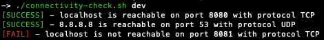

# connectivity-check-yaml-yq

The goal of this project is to have a simple bash script using:

- yq https://github.com/mikefarah/yq utility to parse YAML files
- nc
- timeout

to test network openings from a structured YAML.

This can be useful when checking massive port openings multiple times, for example if 
your business unit is not in charge of firewall openings.

## How to use

The bundled `checks.yaml` file is an example on the check structure:

```yaml
common:
  endpoints:
    - address: localhost
      port: 8080
      protocol: TCP # defaults as TCP check, can be omitted
    - address: 8.8.8.8
      port: 53
      protocol: UDP

environments:
  dev:
    endpoints:
      - address: localhost
        port: 8081
        protocol: TCP
  qa:
    endpoints:
      - address: www.google.it
        port: 80
        protocol: TCP
      - address: www.google.it
        port: 443
        protocol: TCP
```
The map common contains all the endpoints to check every time the script runs.
The map environments contains all the endpoints specific to a certain environment.

In this example `dev` and `qa` are the parameters you need to pass to the check script.
At least one environment is mandatory.

The endpoints are an array with elements with:

- `address` address to test
- `port` the port to check
- `protocol` the protocol, can be TCP,UDP. If omitted, defaults to TCP.

Example output:

